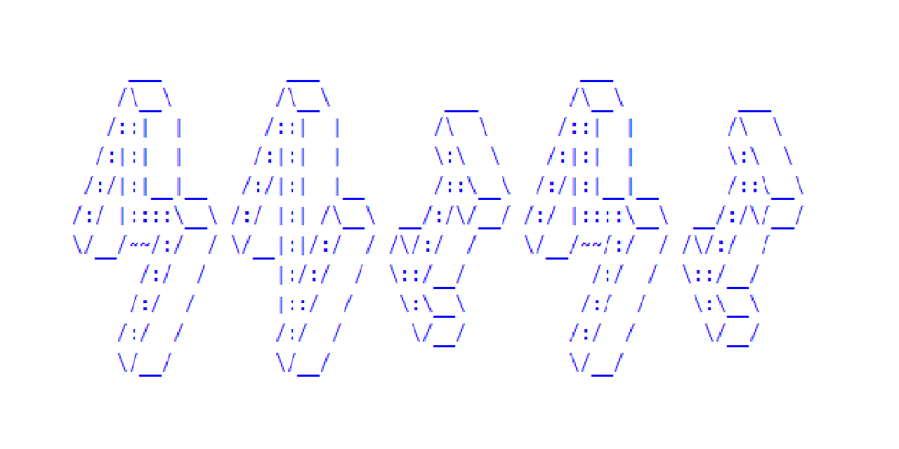

----------	

**Mnimi** is a game of memory skill inspired by [Simon electronic game](https://en.wikipedia.org/wiki/Simon_(game)). The game creates a series of lights and requires a user to repeat the sequence.

Initially, the game has four colored buttons. A round in **Mnimi** consists of the game lighting up one or more buttons in a random order, after which the player must reproduce that order by pressing the buttons. If the user succeeds, the series becomes progressively longer and more complex.

In Greek, **Mnimi** means memory.

  

   Simple Game Just For Fun :bowtie::see_no_evil:

			

## Contributors

- [Sepand Haghighi](https://github.com/sepandhaghighi "Sepand Haghighi")

## Dependencies

### Code

- [SweetAlert](https://sweetalert.js.org/ "SweetAlert")
- [Particles.js](https://github.com/VincentGarreau/particles.js/ "Particles.js")
- [Font-Awesome Icon Set](http://fontawesome.io/ "Font-Awesome Icon Set")
- [Shortcut.js](http://openjs.com/scripts/events/keyboard_shortcuts/ "Shortcut.js")

### Music
- Track-1 : Ukulele - [Bensound.com](https://www.bensound.com/bensound-music/bensound-ukulele.mp3)

- Track-2 : Sunny - [Bensound.com](https://www.bensound.com/bensound-music/bensound-sunny.mp3)

- Track-3 : Smile - [Bensound.com](https://www.bensound.com/bensound-music/bensound-smile.mp3)

- Track-4 : A Day To Remember - [Bensound.com](https://www.bensound.com/bensound-music/bensound-adaytoremember.mp3)

- Track-5 : Acoustic Breeze - [Bensound.com](https://www.bensound.com/bensound-music/bensound-acousticbreeze.mp3)

## Contributing

Changes and improvements are more than welcome! Feel free to fork and open a pull request. Please make your changes in a specific branch and request to pull into `master`! If you can, please make sure the game fully works before sending the PR, as that will help speed up the process.

## Issues & Bug Reports			

Just fill an issue and describe it. We'll check it ASAP!

## Donations

If you do like our game and we hope that you do, can you please support us? Our game is not and is never going to be working for profit. We need the money just so we can continue doing what we do ;-) .			

				

